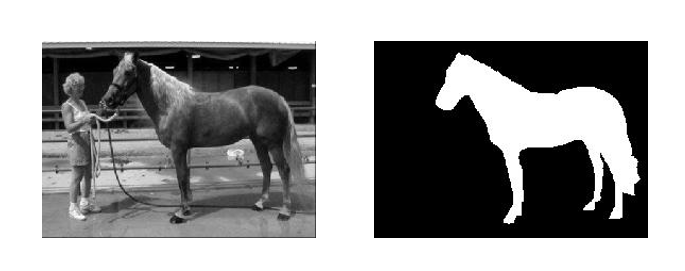

# DeepLab v3+

<p align="center">
  
</p>

This repository includes a Pytorch implementation of DeepLab v3+ for deep semantic segmentation, presented in the paper:

**[Encoder-Decoder with Atrous Separable Convolution for Semantic Image
Segmentation](https://arxiv.org/abs/1802.02611)**

which is also the curriculum design for Visual Cognitive Engineering in HUSTAIA.

Bingquan Gong ( Hua Zhong University of Science and Technology )

## Installation
Our code has been tested on Python 3.8.13 and PyTorch 1.7.1 Please follow the official instructions to configure your environment. 

## Prepare Your Data
1. Please download the **[Weizmann Horse dataset](https://www.kaggle.com/datasets/ztaihong/weizmann-horse-database/metadata)**;
2. Take the first 279 pictures of the dataset as the training set and the last 39 pictures as the test set.
3. The final path structure used in my code looks like this:

````
data
├──── train_data
├──── train_label
├──── test_data
└──── test_label
````

## Training
Run the following command to train DeepLab v3+:
```bash
python main.py --gpu 0 --lr 1e-2 
```

## Test 
Run the following command to test DeepLab v3+:
```bash
python main.py --mode test --checkpoint 1-2-257-200
```

Here is the results of experiment:

| mIoU | BIoU | Acc | Model |
| :--: | :--: | :--: | :--: | 
| 82.86% | 37.61% | 0.9222 | [click]()
